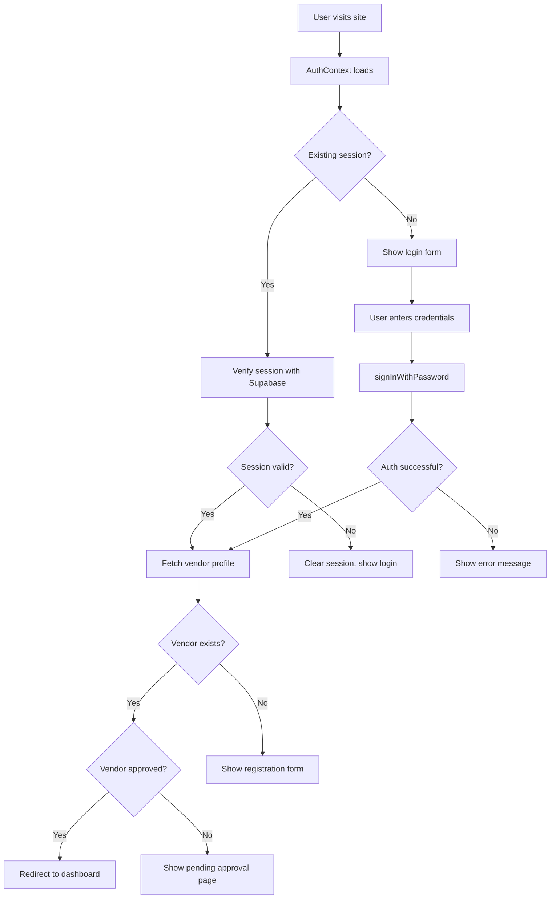

# 🚀 VENDOR DASHBOARD - Frontend Developer Handoff Guide

## 📋 Project Status Overview

**✅ COMPLETED:** 
- Authentication system is fully functional and production-ready  
- Frontend UI/UX is completely built and ready
- React Query hooks and services are implemented

**🎯 NEXT PHASE:** Set up Supabase database tables and connect existing UI to live data  
**📅 Last Updated:** December 2024  
**🔗 Repository:** [vendor-dashboard](https://github.com/saurabh-t-dev/vendor-dashboard)  

---

## 🎯 Mission Critical: What You Need to Know

### 🚨 FRONTEND UI IS COMPLETELY BUILT ✅
The entire vendor dashboard UI is already implemented with modern React components, responsive design, and proper state management. **The main task is database integration, NOT building UI.**

### ✅ What's Already Working Perfectly
- **Authentication System** - Fully functional and production-ready
- **Dashboard UI** - Complete with analytics, charts, and navigation
- **Products Management** - Full CRUD interface with search/filters
- **Orders Management** - Order listing, details, and status updates
- **Analytics Dashboard** - Charts and metrics visualization
- **React Query Integration** - All data hooks are implemented
- **Responsive Design** - Mobile-first, modern UI components

### 🔧 Key Working Files (DO NOT REBUILD)
- **Authentication:** `src/contexts/AuthContext.jsx`, `src/lib/supabase.js` ✅
- **Dashboard UI:** `src/app/(Tabs)/dashboard/` - Complete dashboard interface ✅
- **Products UI:** `src/app/(Tabs)/products/` - Full product management ✅
- **Orders UI:** `src/app/(Tabs)/orders/` - Complete order interface ✅
- **Data Hooks:** `src/hooks/useVendor.js`, `src/hooks/useProducts.js`, `src/hooks/useOrders.js` ✅
- **Services:** `src/services/vendorService.js`, `src/services/productsService.js` ✅

---

## 🔍 Current Status Deep Dive

### 📊 **Dashboard UI Status** ✅ COMPLETE
The dashboard is **fully functional** with these working pages:
- **`src/app/(Tabs)/dashboard/`** - Analytics overview with charts and metrics
- **`src/app/(Tabs)/products/`** - Product management interface  
- **`src/app/(Tabs)/orders/`** - Order management interface
- **`src/app/(Tabs)/analytics/`** - Advanced analytics dashboard
- **`src/app/(Tabs)/payouts/`** - Earnings and payouts interface
- **`src/app/(Tabs)/settings/`** - Vendor settings and profile

### 🔗 **Data Integration Status** ⚠️ NEEDS DATABASE
All UI components are trying to load data via:
- **React Query hooks** in `src/hooks/useVendor.js`, `src/hooks/useProducts.js`, `src/hooks/useOrders.js` ✅
- **Service functions** in `src/services/vendorService.js`, `src/services/productsService.js`, `src/services/ordersService.js` ✅  
- **Supabase queries** that expect tables: `products`, `orders`, `order_items`, `categories` ❌ **MISSING**

### 🚨 **The Problem**
When you log in and visit the dashboard, you'll see:
- Loading states everywhere (because tables don't exist)
- Empty charts and graphs  
- "No products found" messages
- Error messages in browser console about missing tables

**The solution is simple: Create the database tables and the UI will immediately work!**

---

## 🏗️ Current Architecture Overview

### 🔄 Authentication Flow


### 🗂️ File Structure
```
vendor-dashboard/
├── src/
│   ├── app/
│   │   ├── layout.jsx                 # Root layout with providers
│   │   ├── page.jsx                   # Home/login page
│   │   ├── dashboard/
│   │   │   └── page.jsx               # Main dashboard (YOUR WORK)
│   │   ├── vendor-pending/
│   │   │   └── page.jsx               # Pending approval page
│   │   └── api/
│   │       ├── vendor-application/    # Vendor registration API ✅
│   │       ├── my-vendor-profile/     # Vendor profile API ✅
│   │       └── test-auth/            # Auth testing endpoint ✅
│   ├── components/
│   │   ├── AuthRedirect.jsx          # Auth routing logic ✅
│   │   ├── ProtectedRoute.jsx        # Route protection ✅
│   │   └── VendorApplicationForm.jsx # Registration form ✅
│   ├── contexts/
│   │   └── AuthContext.jsx           # Main auth context ✅
│   ├── lib/
│   │   ├── supabase.js              # Supabase client ✅
│   │   └── supabase-server.js       # Server-side client ✅
│   └── providers/
│       └── QueryProvider.jsx        # React Query provider
```

---

## 🎨 Your Mission: Complete the Dashboard UI

### 🎯 Primary Tasks

#### 1. **Dashboard Layout & Navigation** 🏠
**File:** `src/app/dashboard/page.jsx`
**Current Status:** Basic structure exists
**Your Task:** 
- Create a professional vendor dashboard layout
- Add sidebar navigation with sections:
  - 📊 Analytics Overview
  - 📦 Products Management  
  - 📋 Orders Management
  - 💰 Earnings & Payouts
  - ⚙️ Settings
  - 👤 Profile

**Design Requirements:**
- Responsive design (mobile-first)
- Clean, modern UI following BE-SMART design system
- Consistent with main e-commerce app styling

#### 2. **Products Management Interface** 📦
**Files to Create:**
- `src/app/dashboard/products/page.jsx`
- `src/components/ProductForm.jsx`
- `src/components/ProductList.jsx`

**Features to Implement:**
- Product listing with search/filter
- Add/Edit/Delete products
- Image upload functionality
- Category selection
- Inventory management
- Pricing controls

#### 3. **Orders Management Interface** 📋
**Files to Create:**
- `src/app/dashboard/orders/page.jsx`
- `src/components/OrderList.jsx`
- `src/components/OrderDetails.jsx`

**Features to Implement:**
- Order listing with status filters
- Order details view
- Order status updates
- Shipping information
- Customer communication

#### 4. **Analytics Dashboard** 📊
**Files to Create:**
- `src/app/dashboard/analytics/page.jsx`
- `src/components/AnalyticsCharts.jsx`

**Features to Implement:**
- Sales overview charts
- Revenue analytics
- Product performance metrics
- Customer insights

---

## 🔌 API Integration Guide

### 🛠️ Available APIs (Ready to Use)

#### Authentication APIs ✅
```javascript
// Already working - DO NOT MODIFY
GET  /api/my-vendor-profile      // Get current vendor profile
POST /api/vendor-application     // Submit vendor application
GET  /api/vendor-application     // Check application status
```

#### APIs You Need to Create 🎯
```javascript
// Products Management
GET    /api/products             // List vendor products
POST   /api/products             // Create new product
PUT    /api/products/[id]        // Update product
DELETE /api/products/[id]        // Delete product

// Orders Management  
GET    /api/orders               // List vendor orders
PUT    /api/orders/[id]/status   // Update order status
GET    /api/orders/[id]          // Get order details

// Analytics
GET    /api/analytics/sales      // Sales data
GET    /api/analytics/products   // Product performance
GET    /api/analytics/revenue    // Revenue data
```

### 🗄️ Database Schema (Supabase)

#### Key Tables You'll Work With:
```sql
-- Vendors table (already set up)
vendors {
  id: uuid
  user_id: uuid (FK to auth.users)
  business_name: text
  status: text ('pending', 'approved', 'rejected')
  created_at: timestamp
}

-- Products table (your work)
products {
  id: uuid
  vendor_id: uuid (FK to vendors.id)
  title: text
  description: text
  price: decimal
  inventory_count: integer
  category_id: uuid
  images: jsonb
  status: text ('active', 'inactive')
  created_at: timestamp
}

-- Orders table (your work)
orders {
  id: uuid
  customer_id: uuid
  vendor_id: uuid
  status: text
  total_amount: decimal
  created_at: timestamp
}

-- Order Items table (your work)
order_items {
  id: uuid
  order_id: uuid (FK)
  product_id: uuid (FK)
  quantity: integer
  price: decimal
}
```

---

## 🔒 Security & Authentication 

### 🛡️ How Authentication Works (Already Implemented)

#### Context Usage in Components:
```javascript
import { useAuth } from '@/contexts/AuthContext'

function YourComponent() {
  const { user, vendor, loading, error, signOut, clearSession } = useAuth()
  
  // user: Current authenticated user object
  // vendor: Current vendor profile object  
  // loading: Boolean for loading states
  // error: Any authentication errors
  // signOut: Function to log out user
  // clearSession: Function to clear corrupted sessions
  
  if (loading) return <div>Loading...</div>
  if (!user) return <div>Please log in</div>
  if (!vendor) return <div>Please complete vendor registration</div>
  
  return <div>Welcome {vendor.business_name}!</div>
}
```

#### Protected Routes:
```javascript
import ProtectedRoute from '@/components/ProtectedRoute'

function DashboardPage() {
  return (
    <ProtectedRoute>
      <YourDashboardContent />
    </ProtectedRoute>
  )
}
```

#### API Authentication:
```javascript
// For API calls that need authentication
const { data: { session } } = await supabase.auth.getSession()

const response = await fetch('/api/your-endpoint', {
  headers: {
    'Authorization': `Bearer ${session.access_token}`,
    'Content-Type': 'application/json'
  }
})
```

---

## 🚀 Development Workflow

### 🔧 Setup & Running
```bash
# Clone and setup (if not already done)
git clone https://github.com/saurabh-t-dev/vendor-dashboard.git
cd vendor-dashboard
npm install

# Environment setup (already configured)
# .env.local is already set up with Supabase credentials

# Start development server
npm run dev
# App runs on http://localhost:3000
```

### 🧪 Testing Credentials
```
Email: testvendor@gmail.com
Password: testpass123
```

### 🗄️ Database Access
- **Supabase URL:** `https://mfbnxhjfbzbxvuzzbryu.supabase.co`
- **Database access:** Available through Supabase dashboard
- **Auth policies:** Already configured with RLS (Row Level Security)

---

## 📦 Integration with BE-SMART Ecosystem

### 🔗 Key Integration Points

#### 1. **Product Sync** 
- Vendor dashboard products → Main e-commerce catalog
- Inventory synchronization
- Price updates propagation

#### 2. **Order Flow**
- Orders from main app → Vendor dashboard
- Status updates → Customer notifications
- Shipping integration

#### 3. **Payment Integration**
- Vendor earnings calculation
- Payout scheduling
- Commission handling

#### 4. **User Data Sync**
- Vendor profiles ↔ Main user system
- Authentication sharing
- Permission management

---

## 🎨 UI/UX Guidelines

### 🎯 Design Principles
1. **Consistency:** Follow BE-SMART main app design patterns
2. **Responsiveness:** Mobile-first approach
3. **Accessibility:** WCAG 2.1 AA compliance
4. **Performance:** Fast loading, optimized images
5. **User Experience:** Intuitive navigation, clear feedback

### 🌈 Color Palette & Styling
```css
/* Primary Colors (match main BE-SMART app) */
--primary: #10b981        /* Emerald green */
--primary-dark: #059669   
--secondary: #6b7280      /* Gray */
--accent: #3b82f6         /* Blue */

/* Status Colors */
--success: #10b981
--warning: #f59e0b  
--error: #ef4444
--info: #3b82f6

/* Use Tailwind CSS for consistency */
```

### 📱 Component Library
- Use existing Tailwind CSS components
- Create reusable components in `/components`
- Follow atomic design principles
- Use React Hook Form for forms
- Implement proper loading states

---

## 🔍 Debugging & Troubleshooting

### 🛠️ Useful Debug Tools (Already Available)

#### Test Endpoints:
```bash
# Test Supabase connection
curl http://localhost:3000/api/test-supabase

# Test authentication  
curl -X POST http://localhost:3000/api/test-auth \
  -H "Content-Type: application/json" \
  -d '{"email":"testvendor@gmail.com","password":"testpass123"}'
```

#### Console Commands:
```javascript
// Clear corrupted session data
localStorage.clear(); sessionStorage.clear(); location.reload();

// Check current auth state
console.log(await supabase.auth.getSession())

// Check vendor profile
console.log(await fetch('/api/my-vendor-profile', {
  headers: { 'Authorization': `Bearer ${session.access_token}` }
}))
```

### 🚨 Common Issues & Solutions

#### Issue: "Loading screen stuck"
**Solution:** Authentication is working. Check browser console for specific errors.

#### Issue: "401 Unauthorized on API calls"  
**Solution:** Ensure Authorization header is included:
```javascript
headers: { 'Authorization': `Bearer ${session.access_token}` }
```

#### Issue: "Session expired"
**Solution:** Use the built-in session refresh or clearSession function.

---

## 📚 Resources & Documentation

### 🔗 Technical Documentation
- **Supabase Docs:** https://supabase.com/docs
- **Next.js 15 Docs:** https://nextjs.org/docs
- **Tailwind CSS:** https://tailwindcss.com/docs
- **React Query:** https://tanstack.com/query/latest

### 🗄️ Database Schema Reference
- **Supabase Dashboard:** Available for schema inspection
- **RLS Policies:** Already configured for vendor data isolation
- **Migrations:** Use Supabase migration system

### 📖 Project Documentation
- `DEVELOPER_QUICK_START.md` - Basic setup guide
- `BE_SMART_COMPLETE_INTEGRATION_GUIDE.md` - Full ecosystem overview
- `VENDOR_DASHBOARD_INTEGRATION_PLAN.md` - Detailed integration plan

---

## ✅ Phase Completion Checklist

### 🎯 Immediate Next Steps (Week 1)
- [ ] **Dashboard Layout** - Create main dashboard page with navigation
- [ ] **Products Management** - Build product CRUD interface  
- [ ] **Basic Styling** - Implement consistent design system
- [ ] **Responsive Design** - Ensure mobile compatibility

### 🚀 Advanced Features (Week 2-3)
- [ ] **Orders Management** - Complete order handling interface
- [ ] **Analytics Dashboard** - Implement charts and metrics
- [ ] **File Upload** - Add image upload for products
- [ ] **Search & Filters** - Enhanced product/order filtering

### 🔗 Integration Phase (Week 3-4)
- [ ] **Main App Integration** - Connect with BE-SMART ecosystem
- [ ] **Payment Integration** - Vendor earnings and payouts
- [ ] **Notification System** - Real-time order updates
- [ ] **Performance Optimization** - Code splitting, caching

---

## 🆘 Support & Contact

### 🔧 Technical Support
- **Authentication Issues:** Already resolved - working perfectly
- **Database Queries:** Use Supabase dashboard for testing
- **API Development:** Follow existing patterns in `/api` folder

### 📞 Emergency Contacts
- **Repository:** [GitHub - vendor-dashboard](https://github.com/saurabh-t-dev/vendor-dashboard)
- **Database:** Supabase dashboard access available
- **Documentation:** All guides available in repository root

---

## 🎉 Final Notes

### ✨ What's Working Perfectly
- ✅ **Authentication System** - Fully functional, tested, production-ready
- ✅ **Vendor Registration** - Complete workflow implemented
- ✅ **Database Schema** - Core tables set up with proper RLS
- ✅ **API Architecture** - Clean, scalable API structure
- ✅ **Error Handling** - Comprehensive error recovery mechanisms

### 🚀 Your Opportunity  
You're building on a **solid, tested foundation**. The authentication complexity is completely handled. Focus on creating an **amazing user experience** for vendors to manage their business efficiently.

### 🎯 Success Metrics
- **User Experience:** Intuitive, fast, responsive dashboard
- **Performance:** <2s page loads, smooth interactions  
- **Functionality:** Complete vendor business management
- **Integration:** Seamless connection with main BE-SMART app

---

**🔥 Ready to build something amazing? The foundation is rock-solid - now create the best vendor experience possible!**

---

*This document contains everything you need to continue development. The authentication is bulletproof, the architecture is clean, and the path forward is clear. Build with confidence!* 🚀