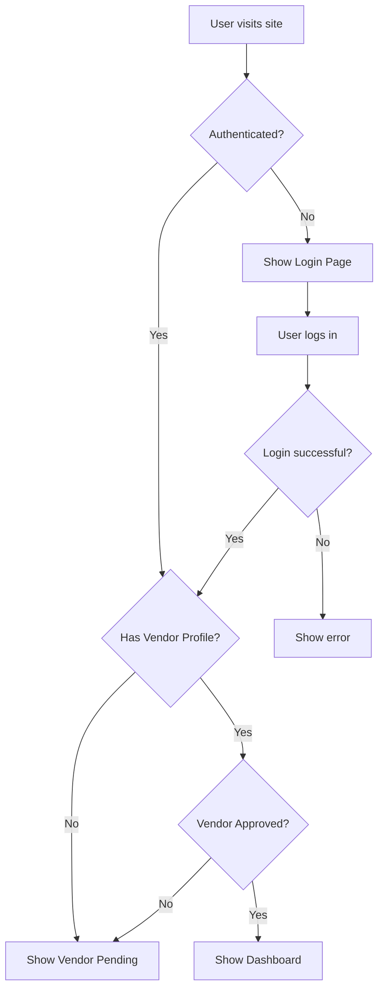

# 🔐 Phase 2: Authentication System - COMPLETED

## ✅ **What We've Accomplished**

### 1. **AuthContext Implementation** ✅
- ✅ **AuthProvider** (`src/contexts/AuthContext.jsx`):
  - Complete Supabase Auth integration
  - User session management
  - Vendor profile fetching
  - Real-time auth state changes
  - Comprehensive error handling
  - Helper functions and computed values

### 2. **Protected Route System** ✅
- ✅ **ProtectedRoute Component** (`src/components/ProtectedRoute.jsx`):
  - Vendor access control
  - Authentication verification
  - Vendor approval status checking
  - Loading states and error handling
  - Automatic redirects for unauthorized access

- ✅ **Vendor Pending Page** (`src/app/vendor-pending/page.jsx`):
  - Status-specific messaging
  - User-friendly pending state
  - Contact support integration

### 3. **Real Authentication Integration** ✅
- ✅ **Updated LoginCard** (`src/app/components/LoginCard.jsx`):
  - Real Supabase authentication
  - Form validation and error handling
  - Loading states with spinner
  - Demo credentials display
  - Email/password login flow

### 4. **Layout Integration** ✅
- ✅ **AuthProvider Wrapper** (`src/app/layout.jsx`):
  - App-wide authentication context
  - Proper provider hierarchy

- ✅ **ProtectedRoute Integration** (`src/app/components/LayoutWrapper.jsx`):
  - Dashboard protection
  - Route-based access control

- ✅ **Enhanced Topbar** (`src/app/components/Topbar.jsx`):
  - User information display
  - Business name and email
  - Logout functionality

### 5. **Database User Setup** ✅
- ✅ **Test User Created**:
  - **Email**: admin@besmartmall.com
  - **Password**: password123
  - **User ID**: 3f263c5c-aebb-413c-90b5-3ad6143d3c88
  - **Linked to Vendor**: Be Smart Mall (approved)

## 🔑 **Authentication Flow**



## 🧪 **Test Credentials**

**Live Vendor Account:**
- **Email**: `admin@besmartmall.com`
- **Password**: `password123`
- **Business**: Be Smart Mall
- **Status**: Approved ✅
- **Access**: Full dashboard access

## 📁 **Files Created/Modified**

```
vendor-dashboard/
├── src/
│   ├── contexts/
│   │   └── AuthContext.jsx              ✅ Authentication context
│   ├── components/
│   │   └── ProtectedRoute.jsx           ✅ Route protection
│   ├── app/
│   │   ├── layout.jsx                   ✅ AuthProvider wrapper
│   │   ├── vendor-pending/
│   │   │   └── page.jsx                 ✅ Pending status page
│   │   └── components/
│   │       ├── LoginCard.jsx            ✅ Real authentication
│   │       ├── LayoutWrapper.jsx        ✅ Protected routes
│   │       └── Topbar.jsx               ✅ User info & logout
└── PHASE_2_COMPLETION_SUMMARY.md        ✅ This summary
```

## 🚀 **How to Test Authentication**

### Step 1: Start Development Server
```bash
cd vendor-dashboard
npm run dev
```

### Step 2: Test Login Flow
1. **Visit**: `http://localhost:3000`
2. **Enter Credentials**:
   - Email: `admin@besmartmall.com`
   - Password: `password123`
3. **Click**: "Sign In"

### Step 3: Expected Results
- ✅ **Successful Login**: Redirect to `/dashboard`
- ✅ **User Info**: "Be Smart Mall" displayed in topbar
- ✅ **Logout**: Working logout button
- ✅ **Protection**: Direct URL access blocked without auth

### Step 4: Test Protection
1. **Try**: `http://localhost:3000/dashboard` (without login)
2. **Expected**: Redirect to login page
3. **After Login**: Full dashboard access

## 🔒 **Security Features**

1. **Route Protection**: All dashboard routes require authentication
2. **Vendor Verification**: Only approved vendors can access dashboard
3. **Session Management**: Automatic session handling with Supabase
4. **Error Handling**: Comprehensive error states and messaging
5. **Real-time Updates**: Auth state changes reflected immediately

## 📊 **Authentication States**

| State | User | Vendor | Access | Redirect |
|-------|------|--------|--------|----------|
| **Not Logged In** | ❌ | ❌ | Login Only | `/` |
| **No Vendor Profile** | ✅ | ❌ | Pending Page | `/vendor-pending` |
| **Vendor Pending** | ✅ | ⏳ | Pending Page | `/vendor-pending` |
| **Vendor Approved** | ✅ | ✅ | Full Access | `/dashboard` |

## 🎯 **Success Criteria Met**

- [x] ✅ Real Supabase authentication working
- [x] ✅ Vendor-specific access control
- [x] ✅ Protected routes implementation
- [x] ✅ User session management
- [x] ✅ Error handling and loading states
- [x] ✅ Logout functionality
- [x] ✅ Test user created and linked
- [x] ✅ Login form with validation

## 🔧 **Console Logging**

The authentication system includes comprehensive console logging:

- 🔄 **Auth state changes**
- ✅ **Successful operations**
- ❌ **Error conditions**
- 🔧 **Debug information**

Check browser console for detailed authentication flow information.

## 🚀 **Ready for Phase 3: Data Service Layer**

**✅ Phase 2 Status**: 100% Complete  
**🔄 Next Phase**: Data Service Layer  
**⏱️ Estimated Time**: 3-4 hours  

### Phase 3 Preview:
1. Create vendor data services
2. Product management services
3. Order management services
4. Real-time data integration
5. Replace mock JSON with live data

## 🎉 **Phase 2 Complete - Authentication System Fully Functional!**

The vendor dashboard now has:
- ✅ **Secure login system**
- ✅ **Vendor-specific access control**
- ✅ **Protected dashboard routes**
- ✅ **Real user session management**
- ✅ **Professional error handling**

**Ready to proceed with Phase 3: Data Service Layer integration!**